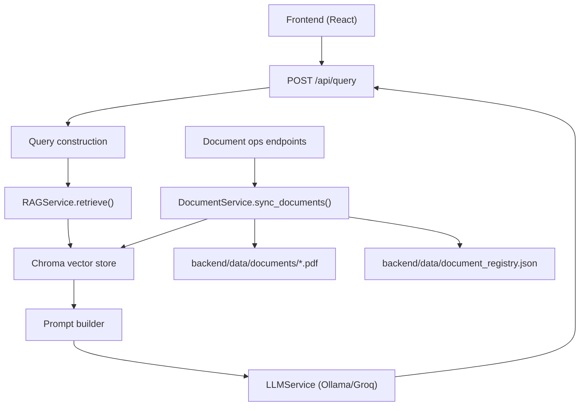

# Benefits Navigator Backend Documentation

## Quickstart

### 1) Provide initial inputs first

Before the system can answer eligibility questions, you need:

- Program documents: add one or more PDF files to `backend/data/documents/`
- LLM provider config:
  - Easiest local option: Ollama (`LLM_PROVIDER=ollama`)
  - Alternative: Groq (`LLM_PROVIDER=groq` + `GROQ_API_KEY`)
- Query payload data at runtime:
  - A question (`query`) - default or custom
  - A user profile object (`user_profile`) with at least `state` and `annual_income` recommended

Minimum useful `user_profile` fields:

- `state`
- `annual_income`
- `household_size`

### 2) Start backend

Run from repository root:

```bash
source .venv/bin/activate
pip install -r backend/requirements.txt
cp .env.example .env
cd backend && uvicorn main:app --reload --port 8000
```

### 3) Ingest your documents

In a second terminal (from repo root):

```bash
source .venv/bin/activate
python scripts/sync_documents.py
```

### 4) Verify system health

```bash
curl http://localhost:8000/health
curl http://localhost:8000/api/documents/status
```

### 5) Run a first query

```bash
curl -X POST http://localhost:8000/api/query \
  -H "Content-Type: application/json" \
  -d '{
    "query":"What benefits might I be eligible for?",
    "user_profile":{
      "state":"NY",
      "annual_income":22000,
      "household_size":3,
      "employment_status":"part-time"
    }
  }'
```

### 6) Optional smoke test

```bash
source .venv/bin/activate
python scripts/test_rag_pipeline.py
```

## Overview

This backend implements a LangChain-based RAG pipeline for public benefits guidance.

High-level flow:

1. Frontend sends user profile + default/custom question to `POST /api/query`.
2. Backend builds a retrieval query from that profile and question.
3. Chroma returns relevant program-document chunks.
4. Backend builds a prompt from retrieved chunks and user context.
5. LLM (Ollama or Groq) generates the response.
6. API returns answer + extracted eligible program bullets + source metadata.

The system also supports incremental document ingestion:

- New PDF added -> embed + store
- Existing PDF changed -> old vectors removed, new vectors written
- PDF removed -> related vectors removed

## Implemented Architecture



## Directory and Module Guide

### API entrypoint

- `backend/main.py`
- What it does:
  - Initializes FastAPI app
  - Configures CORS
  - Wires singleton service dependencies
  - Exposes query + document management endpoints

### Configuration

- `backend/config.py`
- What it does:
  - Loads `.env`
  - Defines data paths (`documents`, `chroma_db`, `document_registry.json`, `hf_cache`)
  - Defines runtime knobs (`RAG_TOP_K`, chunk size/overlap, provider/model names)
  - Creates required directories/files via `ensure_data_dirs()`

### Schemas

- `backend/models/schemas.py`
- What it does:
  - Defines request/response contracts:
    - `QueryRequest`, `QueryResponse`
    - `UserProfile`
    - `DocumentInfo`, `SyncResponse`, `StatusResponse`

### Vector store and embeddings

- `backend/services/vector_store.py`
- What it does:
  - Creates shared singleton `HuggingFaceEmbeddings`
  - Creates shared singleton `Chroma` store
  - Uses local cache under `backend/data/hf_cache` (no global cache dependency)

### Document ingestion and registry

- `backend/services/document_service.py`
- What it does:
  - Scans PDFs in `backend/data/documents`
  - Computes content hash for change detection
  - Splits text with `RecursiveCharacterTextSplitter`
  - Adds/removes vectors in Chroma
  - Maintains registry metadata in `backend/data/document_registry.json`
  - Provides status helpers (`get_document_count`, `get_chunk_count`, `get_last_sync_time`)

### Retrieval

- `backend/services/rag_service.py`
- What it does:
  - Runs semantic retrieval from Chroma (`similarity_search`)
  - Uses configurable `RAG_TOP_K`

### Prompt and query construction

- `backend/services/prompt_builder.py`
- What it does:
  - Builds retrieval query from `UserProfile` + question
  - Formats retrieved docs into prompt context
  - Builds final instruction prompt for the LLM
  - Extracts bullet/numbered candidate program lines from LLM output

### LLM abstraction

- `backend/services/llm_service.py`
- What it does:
  - Selects LLM provider from env:
    - `LLM_PROVIDER=ollama`
    - `LLM_PROVIDER=groq`
  - Calls model and normalizes text response

### Operational scripts

- `scripts/sync_documents.py`: Run document sync from CLI.
- `scripts/ingest_documents.py`: Compatibility alias to sync script.
- `scripts/test_rag_pipeline.py`: End-to-end smoke test (ingest + retrieve, optional LLM).

## API Endpoints

### Health

- `GET /health`
- Returns:
  - `{"status":"ok"}`

### Query

- `POST /api/query`
- Body:

```json
{
  "query": "What benefits am I likely eligible for in NY?",
  "user_profile": {
    "household_size": 3,
    "annual_income": 22000,
    "state": "NY",
    "employment_status": "part-time",
    "has_dependents": true,
    "age": 34
  }
}
```

- Returns:
  - `answer`: full LLM answer
  - `eligible_programs`: extracted bullet/numbered candidates
  - `sources`: metadata from retrieved chunks

### Document sync

- `POST /api/documents/sync`
- Action:
  - Diffs disk and registry, applies add/update/delete
- Returns counts:
  - `added`, `updated`, `deleted`, `total_documents`

### List documents

- `GET /api/documents`
- Returns registry entries with hash, chunk count, timestamps.

### Delete document

- `DELETE /api/documents/{rel_path}`
- Removes vectors + registry entry and deletes file from documents folder.

### Document status

- `GET /api/documents/status`
- Returns:
  - `total_documents`, `total_chunks`, `last_sync`

## How To Run

From repo root:

```bash
source .venv/bin/activate
pip install -r backend/requirements.txt
```

Run API server:

```bash
cd backend
uvicorn main:app --reload --port 8000
```

Interactive docs:

- [http://localhost:8000/docs](http://localhost:8000/docs)

## How To Interact With Each Module

### Add or update program PDFs

1. Put files in `backend/data/documents/`.
2. Sync:

```bash
python scripts/sync_documents.py
```

or

```bash
curl -X POST http://localhost:8000/api/documents/sync
```

### Submit a query

```bash
curl -X POST http://localhost:8000/api/query \
  -H "Content-Type: application/json" \
  -d '{
    "query":"What food and health programs should I look at?",
    "user_profile":{
      "household_size":3,
      "annual_income":22000,
      "state":"NY",
      "employment_status":"part-time"
    }
  }'
```

### Inspect indexed docs

```bash
curl http://localhost:8000/api/documents
curl http://localhost:8000/api/documents/status
```

### Remove an indexed document

```bash
curl -X DELETE "http://localhost:8000/api/documents/snap_benefits.pdf"
```

## Testing Guide

### 1) End-to-end smoke test

```bash
python scripts/test_rag_pipeline.py
```

What it verifies:

- sample PDF creation
- document sync into Chroma
- retrieval from vector store
- schema usage
- cleanup path

Optional LLM execution:

```bash
RUN_LLM_SMOKE=1 python scripts/test_rag_pipeline.py
```

### 2) API smoke test

Server running in one terminal:

```bash
cd backend
uvicorn main:app --reload --port 8000
```

Then in another:

```bash
curl http://localhost:8000/health
curl http://localhost:8000/api/documents/status
```

### 3) Module-level manual checks

- `document_service.py`
  - Add PDF -> `sync_documents()` should increment `added`
  - Edit PDF -> `sync_documents()` should increment `updated`
  - Delete PDF -> `sync_documents()` should increment `deleted`
- `rag_service.py`
  - After sync, `retrieve()` should return docs for relevant queries
- `llm_service.py`
  - `LLM_PROVIDER=ollama`: ensure Ollama daemon/model is available
  - `LLM_PROVIDER=groq`: ensure `GROQ_API_KEY` exists

## Environment Variables

Defined in `.env.example`:

- `LLM_PROVIDER` (`ollama` or `groq`)
- `OLLAMA_MODEL`, `OLLAMA_BASE_URL`
- `GROQ_API_KEY`, `GROQ_MODEL`
- `EMBEDDING_MODEL`
- `CHROMA_COLLECTION_NAME`
- `RAG_TOP_K`
- `CHUNK_SIZE`, `CHUNK_OVERLAP`
- `CORS_ORIGINS`

## Debugging Notes

- If `/api/query` returns 503:
  - Provider likely unavailable or misconfigured.
  - Check `LLM_PROVIDER` and associated credentials/runtime.
- If retrieval quality is weak:
  - Revisit chunking (`CHUNK_SIZE`, `CHUNK_OVERLAP`) and `RAG_TOP_K`.
- If sync counts look wrong:
  - Inspect `backend/data/document_registry.json` and ensure filenames match expected relative paths.
- If embedding model download fails:
  - Confirm network access and that `backend/data/hf_cache` is writable.
